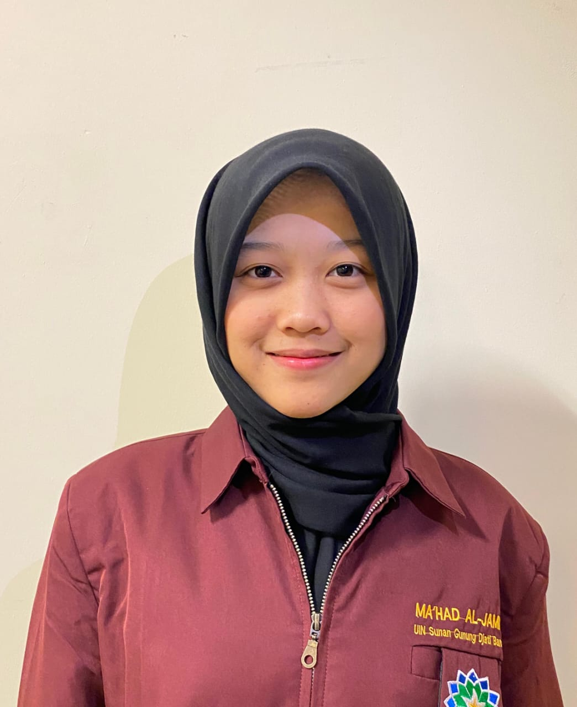
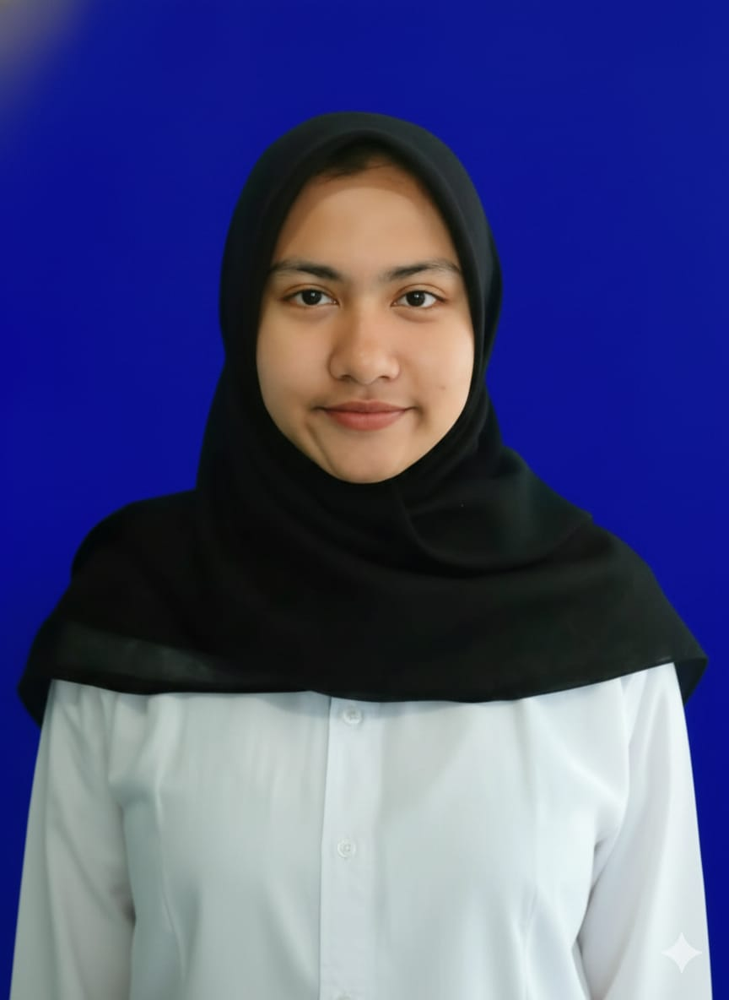

# Gawean – Gamified To-Do List Application 🎯

<p align="center">
  
  
  
  
</p>

**Gawean** adalah aplikasi To-Do List berbasis gamifikasi yang dirancang untuk meningkatkan motivasi, konsistensi, dan produktivitas harian. Proyek ini dikembangkan sebagai **Tugas Akhir Mata Kuliah Interaksi Manusia dan Komputer (IMK)**.

---

## 👨‍💻 Our Team

| [<br><sub>**Syahir Mohamad Ramdhan**</sub>](https://github.com/Syahirmr)<br>1237050022 | [<br><sub>**Salma Nur Oktavia**</sub>](https://github.com/Skskydh)<br>1237050028 | [<br><sub>**Sarah Nurul Yakin**</sub>](https://github.com/Sarahnurulyakin)<br>1237050014 |
| :---: | :---: | :---: |
| UI/UX Designer | Frontend Developer | Documentation & QA |

<p align="center">
  <b>Informatics Engineering</b><br>
  <a href="https://uinsgd.ac.id/">UIN Sunan Gunung Djati Bandung</a> • 
  <a href="http://if.uinsgd.ac.id/">Jurusan Teknik Informatika</a>
</p>

---

## 📂 Project Resources

Untuk informasi mendalam mengenai proses perancangan dan desain aplikasi, silakan akses tautan berikut:

* 📚 **[Pitch Deck - Gawean Application](https://www.canva.com/design/DAG9Luq-qmo/CWSt-ZWf2xhHc_kdaDHoug/edit?utm_content=DAG9Luq-qmo&utm_campaign=designshare&utm_medium=link2&utm_source=sharebutton)**

---

## 📋 Ringkasan Proyek

### 📌 Latar Belakang
Banyak individu mengalami kesulitan dalam menjaga konsistensi dan motivasi saat menyelesaikan tugas harian. Aplikasi konvensional dinilai kurang interaktif, sehingga menyebabkan prokrastinasi. **Gawean** hadir dengan pendekatan **Gamifikasi** untuk memberikan feedback instan bagi produktivitas pengguna.

### ❗ Masalah & Solusi
- **Masalah:** Rendahnya konsistensi, kurangnya motivasi, dan sulitnya memantau progres secara menyenangkan.
- **Solusi:** Penerapan konsep poin, level, dan achievement untuk meningkatkan *engagement* pengguna melalui metode *User-Centered Design* (UCD).

---

## 🧩 Fitur Utama
Aplikasi ini dilengkapi dengan fitur-fitur esensial untuk produktivitas:
- 🔐 **Authentication:** Login & Register yang aman.
- 📝 **Task Management:** Operasi CRUD tugas harian.
- 🎮 **Gamification System:** Perolehan Poin, kenaikan Level, dan Achievement.
- 📊 **Insight Dashboard:** Ringkasan progres tugas yang intuitif.
- 🌗 **Flexible UI:** Dukungan penuh untuk Dark Mode & Light Mode.

---

## ⚙️ Metodologi Pengembangan
Kami menggunakan alur **User-Centered Design (UCD)** untuk memastikan aplikasi tepat sasaran:
1. **Empathize:** Memahami kendala produktivitas pengguna.
2. **Define:** Menentukan kebutuhan fitur utama.
3. **Ideate:** Menyusun konsep gamifikasi.
4. **Prototype:** Pengembangan antarmuka (UI) menggunakan Flutter.
5. **Testing:** Validasi kegunaan aplikasi kepada target pengguna.

---

## 🛠️ Tech Stack & Alat
- **Framework:** Flutter (Dart)
- **UI Kit:** Material Design 3
- **IDE:** Android Studio / VS Code
- **Version Control:** Git & GitHub

---

## 🚀 Instalasi & Penggunaan

Ikuti langkah berikut untuk menjalankan proyek di perangkat lokal Anda:

```bash
git clone https://github.com/USERNAME_KAMU/gawean.git
cd gawean
flutter pub get
flutter run
