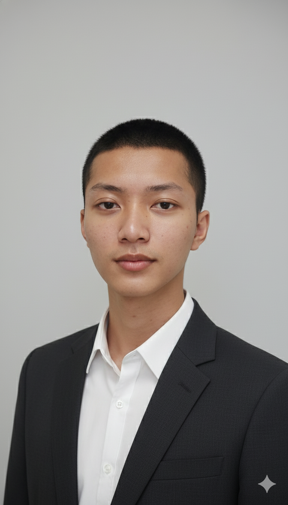
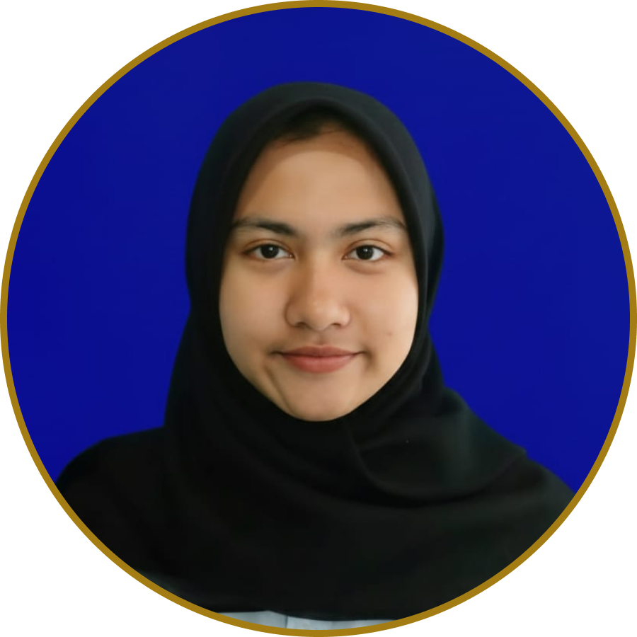

# Gawean – Gamified To-Do List Application 🎯

<p align="center">
  
  
  
  
</p>

**Gawean** adalah aplikasi To-Do List berbasis gamifikasi yang dirancang untuk membantu pengguna meningkatkan motivasi, konsistensi, dan produktivitas dalam menyelesaikan tugas harian. Aplikasi ini dikembangkan sebagai **Tugas Akhir Mata Kuliah Pengembangan Aplikasi Mobile (PAM)**.

---

## 👨‍💻 Our Team

<div align="center">

| [<br><sub>**Syahir Mohamad Ramdhan**</sub>](https://github.com/Syahirmr) | [<br><sub>**Salma Nur Oktavia**</sub>](https://github.com/Skskydh) | [<br><sub>**Sarah Nurul Yakin**</sub>](https://github.com/Sarahnurulyakin) |
|:---------------------------------------------------------------------------------------------------------------------------------------------------------------------------:|:--------------------------------------------------------------------------------------------------------------------------------------------------------------------:|:----------------------------------------------------------------------------------------------------------------------------------------------------------------------------:|
|                                                                                                   |                                                                                            |                                                                                                    |
|                                                                             **Project Leader**                                                                              |                                                                          **UI/UX Designer**                                                                          |                                                                            **Frontend Developer**                                                                            |
|                                                                             Fullstack Developer                                                                             |                                                                          Frontend Developer                                                                          |                                                                              Documentation & QA                                                                              |

<br>

<b>Informatics Engineering</b><br>
<a href="https://uinsgd.ac.id/">UIN Sunan Gunung Djati Bandung</a> • <a href="http://if.uinsgd.ac.id/">Jurusan Teknik Informatika</a>
</div>

---

## 📂 Project Resources

Berikut adalah sumber daya utama terkait pengembangan aplikasi Gawean:

* 📚 **[Pitch Deck - Gawean Application](https://www.canva.com/design/DAG9Luq-qmo/CWSt-ZWf2xhHc_kdaDHoug/edit?utm_content=DAG9Luq-qmo&utm_campaign=designshare&utm_medium=link2&utm_source=sharebutton)**
* 📝 **[Case Study & Documentation (Medium)](https://medium.com/@salmanuroktavia2004/gawean-gamify-to-do-list-level-up-produktivitas-dengan-sistem-quest-poin-dan-badge-4a10cb3225c0)**

---

## 📋 Ringkasan Proyek

### 📌 Latar Belakang
Banyak individu mengalami kesulitan dalam mengatur waktu dan menjaga motivasi dalam menyelesaikan tugas. Aplikasi pencatat tugas konvensional seringkali terasa membosankan. **Gawean** hadir sebagai solusi manajemen tugas yang interaktif melalui pendekatan **Gamifikasi**.


### ❗ Identifikasi Masalah & Solusi
- **Masalah:** Kurangnya feedback atau reward yang mendorong produktivitas serta sulitnya memantau progres secara berkelanjutan.
- **Solusi:** Menerapkan sistem poin, level, dan achievement menggunakan metode **User-Centered Design (UCD)** untuk menciptakan pengalaman pengguna yang intuitif.

---

## 🧩 Fitur Utama
- 📝 **Task Management:** Operasi CRUD tugas harian.
- 🎮 **Gamification:** Perolehan Poin, Leveling system, dan Achievements.
- 📊 **Insight Dashboard:** Visualisasi ringkasan progres tugas.
- 🌗 **Theming:** Mendukung Dark Mode & Light Mode.

---

## ⚙️ Metode Pendekatan
Pengembangan ini mengikuti lima tahapan **User-Centered Design (UCD)**:
1. **Empathize** (Empati terhadap kendala pengguna)
2. **Define** (Menentukan inti permasalahan)
3. **Ideate** (Menciptakan solusi kreatif)
4. **Prototype** (Membangun antarmuka aplikasi)
5. **Testing** (Validasi kepada pengguna akhir)

---

## 🛠️ Teknologi yang Digunakan
- **Framework:** [Flutter](https://flutter.dev/) (Dart)
- **UI System:** Material Design 3
- **Tools:** Android Studio, VS Code, Git

---

## 🚀 Cara Menjalankan Proyek

```bash
# 1. Clone repository ini
git clone https://github.com/Syahirmr/gawean-app

# 2. Masuk ke folder project
cd gawean

# 3. Ambil dependencies Flutter
flutter pub get

# 4. Jalankan aplikasi (pastikan Emulator/Device sudah siap)
flutter run